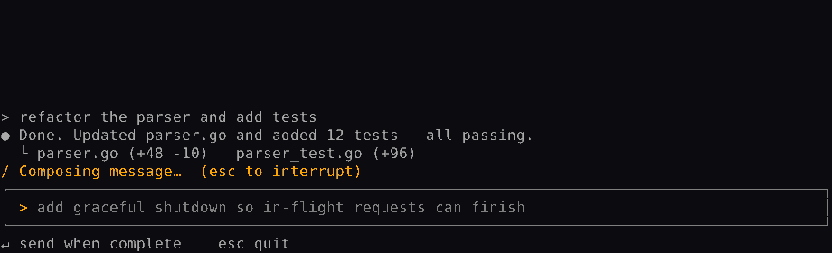
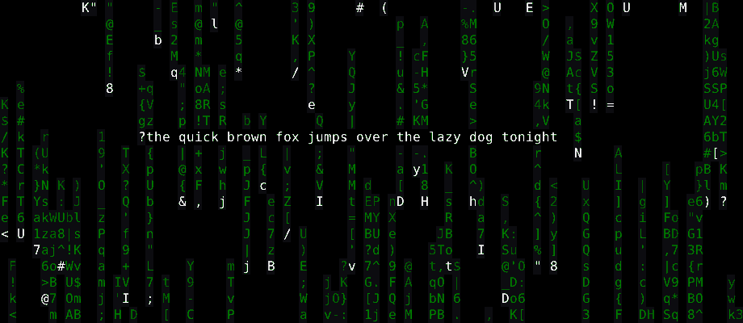
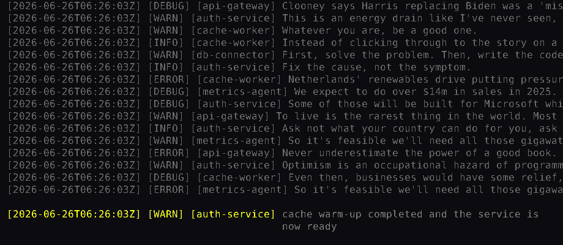

# TermType

Typing practice in your terminal. Six themes — a plain screen, a log stream,
Matrix rain, a hex editor, a git diff, and a live Claude Code session — with
English and Korean sentences, personal bests, and a stats summary.



## Installation

### Homebrew (macOS, Linux)

```bash
brew install namest504/termtype/termtype
```

### Go

```bash
go install github.com/namest504/termtype/cmd/termtype@latest
```

### Prebuilt binaries

Grab an archive for macOS, Linux, or Windows from the
[releases page](https://github.com/namest504/termtype/releases) and put the
`termtype` binary on your `PATH`.

## Usage

```bash
termtype
```

Pick a theme with `↑`/`↓`, a mode with `Tab`, the text with `Space`, and a
language with `←`/`→`, then press `Enter`. The menu remembers your last
selections.

- **Normal** — type the target; WPM and accuracy are shown when you finish.
- **Time Attack** — race a 15s, 30s, or 60s countdown and type as much as you
  can before time runs out.
- **Text** — type the built-in sentences, or a random stream of common
  English words.
- **Language** — choose English or Korean (한국어). Korean uses an IME, and the
  themes lay out the wide Hangul glyphs correctly. The words stream is
  English-only for now.

A live WPM/accuracy readout (and the countdown, in Time Attack) is shown in the
top-right corner while you type, on every theme.

### Result graph

While you type, TermType samples your WPM once a second. After a round,
press `g` for a WPM-over-time graph with an accuracy/raw/cpm summary — the
`cozy` theme draws it right on its result screen. The series is saved with
each round.

### History & personal bests

Every finished round is saved to `~/.config/termtype/history.jsonl` (or your
platform's config directory). The result screen shows `NEW BEST!` when you set
a personal best, or your current best plus a sparkline of the last 10 rounds.
Bests are tracked separately per mode and language.

Press `h` on the menu to browse past rounds — pick one to replay its WPM
graph (rounds recorded before the graph feature show their summary only).

See a summary of your history without starting the game:

```bash
termtype --stats
```

### Any terminal, any width

TermType adapts to the terminal: the core themes reflow down to 20 columns, the
menu and overlays shrink to fit, and the layout reflows as you resize.

For terminals or fonts that can't render the Unicode symbols (boxes, the
spinner, ⏱/⏸), run with `--ascii` for a plain-ASCII rendering:

```bash
termtype --ascii
```

It is auto-enabled for non-UTF-8 locales, or you can force it with
`TERMTYPE_ASCII=1`.

### Controls

- `Ctrl-P` — pause / resume
- `Enter` — next sentence (after finishing)
- `Esc` — back to the menu (from the menu it quits)
- `Ctrl-C` — quit from anywhere

## Available Themes

- `simple`: A simple, clean interface.
- `cozy`: A warm, minimal screen — three lines of text, a small timer, and
  nothing else. Pairs well with the words stream.
- `log`: A theme that simulates a log stream.
- `matrix`: A theme inspired by The Matrix.
- `hex`: A theme that mimics a hex editor.
- `diff`: A theme that looks like a git diff.
- `claude`: A theme that looks like composing a message in a Claude Code session.

All themes adapt to the terminal size and reflow as you resize the window.

### In action

The `matrix` and `log` themes:



