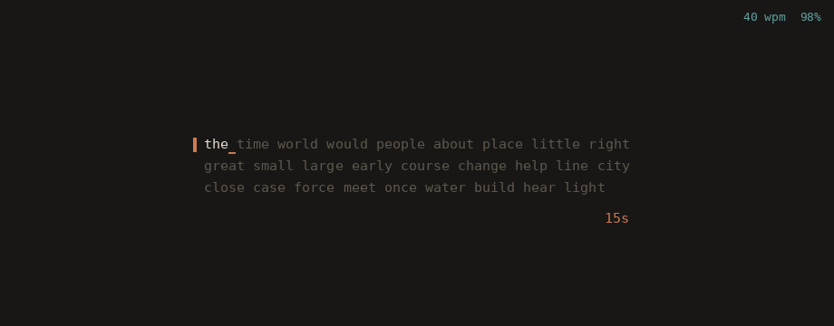

# TermType

Typing practice in your terminal.



- **Seven themes** — from a warm minimal screen (`cozy`, the default) to a
  log stream, a Matrix rain, a git diff, a hex editor, and a live Claude
  Code session.
- **Sentences or words** — the built-in sentence pool, or a random stream
  of common English words.
- **Normal and Time Attack** — untimed rounds, or a 15/30/60-second race.
- **English and Korean** — Korean IME input with correct wide-glyph layout.
- **WPM graph** — sampled every second while you type, drawn as a smooth
  curve when the round ends.
- **History and personal bests** — every round is saved; replay past
  graphs from the menu.
- **Runs anywhere** — macOS, Linux, and Windows; layouts reflow down to 20
  columns, with an `--ascii` mode for limited fonts.

## Installation

### Homebrew (macOS, Linux)

```bash
brew install namest504/termtype/termtype
```

### Go

```bash
go install github.com/namest504/termtype/cmd/termtype@latest
```

### Prebuilt binaries

Grab an archive for macOS, Linux, or Windows from the
[releases page](https://github.com/namest504/termtype/releases) and put the
`termtype` binary on your `PATH`.

## Quick start

```bash
termtype
```

The menu opens on the `cozy` theme and remembers your selections for the
next launch:

- `↑`/`↓` — theme
- `Tab` — mode: Normal, or Time Attack (15s / 30s / 60s)
- `Space` — text: built-in sentences, or a stream of common English words
- `←`/`→` — language: English or Korean (한국어; the words stream is
  English-only for now)
- `g` — result graph on/off
- `h` — history browser
- `Enter` — start, `Esc` — quit

While you type, a live WPM/accuracy readout (and the countdown, in Time
Attack) sits in the top-right corner on every theme. `Ctrl-P` pauses,
`Esc` goes back to the menu, and `Ctrl-C` quits from anywhere.

## Result graph

TermType samples your WPM once a second. When a round ends, a
WPM-over-time graph pops up with an accuracy/raw/cpm summary; `g` toggles
back to the theme's own result screen. The `cozy` theme draws the chart
right on its result screen instead. Turn the automatic graph off from the
menu (`g` — `Graph: Off`) and it stays on the `g` key only.

## History & personal bests

Every finished round is saved to `~/.config/termtype/history.jsonl` (or
your platform's config directory). The result screen shows `NEW BEST!`
when you set a personal best, or your current best plus a sparkline of the
last 10 rounds. Bests are tracked separately per mode, language, and text
source.

Press `h` on the menu to browse past rounds — pick one to replay its WPM
graph. For a summary without starting the game:

```bash
termtype --stats
```

## Any terminal, any width

The layout reflows as you resize, down to 20 columns. For terminals or
fonts that can't render the Unicode symbols (boxes, the spinner, ⏱/⏸, the
braille graph), run with `--ascii` for a plain-ASCII rendering:

```bash
termtype --ascii
```

It is auto-enabled for non-UTF-8 locales, or force it with
`TERMTYPE_ASCII=1`.

## Themes

- `cozy` (default) — a warm, minimal screen: three lines of text, a small
  timer, and nothing else. Pairs well with the words stream.
- `log` — typing woven into a scrolling log stream.
- `simple` — a plain, clean screen.
- `matrix` — green rain, inspired by The Matrix.
- `hex` — mimics a hex editor.
- `diff` — looks like a git diff.
- `claude` — composing a message in a live Claude Code session.

The `claude`, `matrix`, and `log` themes in action:


